  <picture>
    <source media="(max-width: 600px)" srcset="./assets/profile-header-mobile.svg">
    
  </picture>

---

## About me

Senior Data Analyst and AI Engineer in fintech. Data pipelines, AI agents and retrieval systems in production.

I own the data and AI layer behind a payments product: SQL and BigQuery pipelines, cohort dashboards, and AI agents that take recurring analysis off the team's hands. Today that means the Individuals segment at Mercado Pago and the ANSES product, the digital channel that delivers social benefits to more than 1M people in Argentina. When I joined we were processing around 500K payments per month; I helped take it past 1.8M in under a year.

I don't stop at the diagnosis. I go into the technical layer until I actually understand it, and then I build the fix.

- 🏦 **Senior Data Analyst & AI Engineer** · Mercado Pago (Mercado Libre) · Feb 2025–present
- 🤖 **AI engineering** — MCP servers, retrieval systems, and specialized agents for SQL querying, analysis, dashboard generation and web scraping. Several are used by other business units
- 🔍 **Retrieval** — built a document intake and retrieval pipeline for a fintech compliance team in 2022, before RAG was a category. I run the generation half now on my own vector database, feeding a local agent
- 🔧 **Data engineering** — automated KPI pipelines in BigQuery orchestrated with n8n; Python DAGs on Airflow; two weeks of manual reporting cut to under an hour
- 🎓 **Industrial Engineer (Mechatronics)** · Universidad Austral · GPA 7.49
- 🏫 **Adjunct Professor** · Operations Research (2022–) & Quantitative Methods (2026–) · Universidad Austral · Teaching since 2018
- 👁️ **OpenCV AI Competition 2021** — Phase 1 finalist, with my degree thesis on computer vision for industrial process optimization
- 🌎 Spanish native · English C1 (Cambridge FCE, grade A\*) · Buenos Aires, UTC-3

---

## 🛠️ Tech Stack

**Data & Analytics**

**Visualization**

**Automation & Infrastructure**

**AI Engineering (building with)**

**AI tooling (daily driver)**

---

## 🗂️ Projects

Selected public work across AI engineering, data automation, and computer vision.

| Project | What it is | Stack |
|---|---|---|
| [**jobstash-community-mcp**](https://github.com/pato-gonzalez/jobstash-community-mcp) | MCP server that lets AI agents search open job listings on JobStash. Ships an `mcp.json` manifest and a `.well-known/mcp-server.json` endpoint, so any MCP client can discover it. Built at a Vercel hackathon | TypeScript · MCP · Vercel |
| [**ProyectoRobotVA**](https://github.com/pato-gonzalez/ProyectoRobotVA) | My engineering degree thesis: a computer vision system for industrial process optimization. Phase 1 finalist in the OpenCV AI Competition 2021 | Python · OpenCV |
| [**design-system-stack**](https://github.com/pato-gonzalez/design-system-stack) | A skill bundle for AI coding agents: extract a design system from a live site and generate token files | Python · AI agents |
| [**guia-corporativa-claude**](https://github.com/pato-gonzalez/guia-corporativa-claude) | Spanish-language guide for setting up Claude Code on a corporate machine | HTML · docs |
| [**MetabaseGsheetsIntegration**](https://github.com/pato-gonzalez/MetabaseGsheetsIntegration) | Import a Metabase question straight into a Google Sheet | JavaScript · Apps Script |

---

## 🚀 What I'm building now

| Project | Description | Stack |
|---|---|---|
| [**separ8.app**](https://separ8.app) | **Current main project · private codebase.** AI audio stem separator running models on serverless GPUs | Python · Modal · audio ML |
| **Personal knowledge RAG** | Notes, posts, video embeddings and books indexed into a vector database, feeding a local Hermes agent. This is where I run the generation half of retrieval | Vector DBs · embeddings · RAG |
| **MCP server for a personal agent knowledge base** | Self-hosted MCP server giving my local agents access to a shared knowledge base | MCP · self-hosted |
| **AI automation pipelines** | Web scraping and workflow automation for recurring work | n8n · Python · Claude |

---

## 📊 Public GitHub activity

Pull-request and contribution counts below reflect public repositories only. My current main build, separ8.app, is a private codebase developed through human-directed agentic coworking and human in the loop workflow; earlier Lemon and actual Mercado Libre contributions live in private organization repositories.

<picture>
  <source media="(prefers-color-scheme: dark)" srcset="https://github-profile-summary-cards.vercel.app/api/cards/stats?username=pato-gonzalez&amp;theme=github_dark&amp;title_color=58a6ff">
  <source media="(prefers-color-scheme: light)" srcset="https://github-profile-summary-cards.vercel.app/api/cards/stats?username=pato-gonzalez&amp;theme=github">
  
</picture>

<picture>
  <source media="(prefers-color-scheme: dark)" srcset="https://github-profile-summary-cards.vercel.app/api/cards/repos-per-language?username=pato-gonzalez&amp;theme=github_dark&amp;title_color=58a6ff">
  <source media="(prefers-color-scheme: light)" srcset="https://github-profile-summary-cards.vercel.app/api/cards/repos-per-language?username=pato-gonzalez&amp;theme=github">
  
</picture>

<picture>
  <source media="(prefers-color-scheme: dark)" srcset="https://github-profile-summary-cards.vercel.app/api/cards/profile-details?username=pato-gonzalez&amp;theme=github_dark&amp;title_color=58a6ff">
  <source media="(prefers-color-scheme: light)" srcset="https://github-profile-summary-cards.vercel.app/api/cards/profile-details?username=pato-gonzalez&amp;theme=github">
  
</picture>

---

## 📬 Let's connect

- **LinkedIn:** [linkedin.com/in/cpatriciogg](https://www.linkedin.com/in/cpatriciogg/)
- **separ8.app:** [separ8.app](https://separ8.app)
- **Location:** Buenos Aires, Argentina — UTC-3, 1-2h overlap with US East Coast
